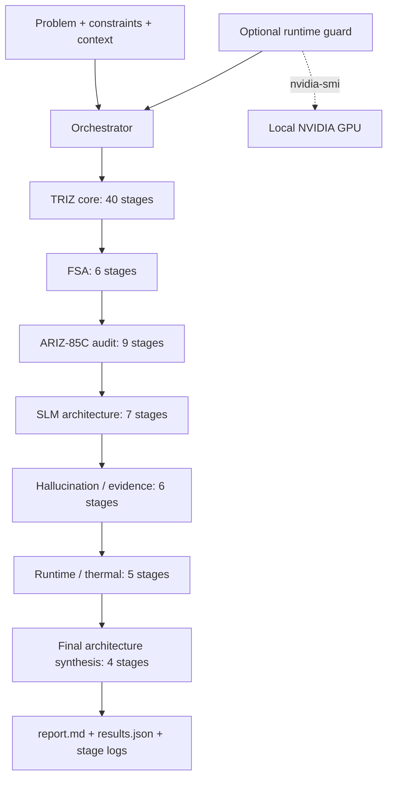

# TRIZ LLM Agent Studio

Инженерный оркестратор для улучшения **малых языковых моделей и локальных LLM-систем** с ограниченным бюджетом — в первую очередь конфигураций, где веса и/или рабочая память ограничены примерно **12 GB**.

Проект объединяет классические инструменты ТРИЗ с отдельными контурами **ИКР, ФСА, АРИЗ-85C, RAG, anti-hallucination verification, VRAM/KV-cache optimization, runtime/thermal control и evaluation**. Каждый этап выполняется отдельным stateless-вызовом к LM Studio и сохраняется как воспроизводимый артефакт.

> Главное отличие от обычного «попросить LLM применить ТРИЗ»: задача разбивается на формальные этапы, каждый этап имеет обязательные поля, quality checks, отдельный лог и handoff в следующий этап.

## Что изменено

- сохранен прежний 40-шаговый `core`-пайплайн;
- добавлен отдельный **ФСА**: компонентная модель, функции, функциональные недостатки, стоимость, value map, trimming;
- добавлен **9-частный ARIZ-85C-контур** для повторной жесткой проверки решения;
- добавлены этапы архитектуры малой LLM: memory budget, routing, RAG, hybrid retrieval, rerank, context packing, tools, memory/agent loop;
- добавлен отдельный контур **галлюцинаций и доказательности**: claim decomposition, evidence coverage, contradiction detection, verifier, abstention, adversarial tests, release gates;
- добавлен блок **runtime/thermal**: VRAM/KV-cache, TTFT/tokens/s, power/thermal throttling, adaptive degradation, soak tests;
- добавлен локальный NVIDIA runtime guard через `nvidia-smi`;
- добавлены профили `core`, `triz_full`, `slm_full`;
- системный prompt усилен запретом на выдумывание метрик, аппаратных лимитов, стандартов и источников;
- добавлены unit tests и GitHub Actions.

## Архитектура



Полный профиль `slm_full` содержит **77 этапов**.

## Профили

| Профиль | Этапов | Назначение |
|---|---:|---|
| `core` | 40 | Исходный TRIZ-пайплайн |
| `triz_full` | 55 | Core + ФСА + 9 частей ARIZ-85C |
| `slm_full` | 77 | Полный TRIZ/FSA/ARIZ + SLM architecture + reliability + runtime |
| `full` | 77 | Alias для `slm_full` |

Выбор:

```json
{
  "pipeline_profile": "slm_full"
}
```

## Полный каталог блоков

| Блок | Содержание | Этапы |
|---|---|---:|
| 1 | Анализ исходной задачи | 6 |
| 2 | Модель задачи | 5 |
| 3 | ИКР и физическое противоречие | 4 |
| 4 | Ресурсный анализ | 5 |
| 5 | Вепольный анализ и стандарты | 4 |
| 6 | Матрица противоречий и принципы | 4 |
| 7 | Разрешение физического противоречия | 4 |
| 8 | Генерация концептов | 4 |
| 9 | Развитие решения | 4 |
| 10 | ФСА | 6 |
| 11 | ARIZ-85C | 9 |
| 12 | Архитектура малой LLM | 7 |
| 13 | Надежность / галлюцинации | 6 |
| 14 | Runtime / thermal | 5 |
| 15 | Синтез архитектуры SLM | 4 |
| **Итого `slm_full`** |  | **77** |

## ФСА

ФСА реализован отдельным блоком:

1. `10.1` — компонентная модель;
2. `10.2` — функциональная модель `носитель → действие → объект`;
3. `10.3` — полезные, вредные, недостаточные и избыточные функции;
4. `10.4` — цена функций: деньги, compute, VRAM/RAM, latency, energy, complexity;
5. `10.5` — value map и кандидаты на trimming/свертывание;
6. `10.6` — перенос/объединение функций и проверка результата.

Для LLM стоимость — это не только деньги. Компонент может быть полезным, но слишком дорогим по VRAM, TTFT, context tokens, retrieval latency или эксплуатационной сложности.

Подробнее: [`docs/TRIZ_METHODS.md`](docs/TRIZ_METHODS.md).

## АРИЗ-85C

После обычного TRIZ-прохода `triz_full` и `slm_full` запускают дополнительный 9-частный ARIZ-контур:

1. анализ задачи и усиленная мини-задача;
2. ОЗ, ОВ и вещественно-полевые ресурсы;
3. ИКР-1 и физическое противоречие;
4. мобилизация/преобразование ресурсов;
5. информационный фонд ТРИЗ;
6. переформулирование и смена системного уровня;
7. проверка реального снятия физического противоречия;
8. развитие и перенос найденного решения;
9. аудит самого хода решения.

Это программная декомпозиция общей девятичастной структуры ARIZ-85C, а не дословная нормативная публикация исторического алгоритма.

## RAG и knowledge architecture

Проект не считает RAG универсальным ответом. Блок 12 сначала решает, где retrieval нужен вообще, а затем проектирует:

- query rewrite/decomposition;
- sparse/dense/hybrid/graph retrieval;
- metadata filtering;
- reranker;
- chunking и дедупликацию;
- context packing;
- source priority;
- citation/grounding policy;
- обработку противоречивых источников;
- fallback на tool/API или abstention.

Для малых моделей особенно важно не максимизировать контекст, а подавать **малый, чистый и доказательный context window**.

Подробнее: [`docs/SLM_PLAYBOOK.md`](docs/SLM_PLAYBOOK.md).

## Контроль галлюцинаций

В `slm_full` предусмотрен отдельный reliability-контур:

```text
Answer draft
   ↓
Claim extraction
   ↓
Evidence coverage ── missing ──> retrieve / tool / abstain
   ↓
Contradiction check
   ↓
Independent verifier
   ↓
Pass / correct / escalate
```

Правила:

- self-confidence модели не считается доказательством;
- self-reflection той же модели не считается полностью независимым verifier;
- отсутствие правильного retrieval-фрагмента не должно компенсироваться уверенной догадкой;
- unanswerable-запросы входят в evaluation;
- правильный отказ от ответа — допустимый успешный исход;
- найденные failure cases добавляются в regression corpus.

Метрики и release gates: [`docs/EVALUATION.md`](docs/EVALUATION.md).

## Память: веса ≠ VRAM

Даже если файл весов меньше 12 GB, реальное потребление может быть выше из-за KV-cache, длинного context window, batch/concurrency, backend buffers, embeddings/reranker/vision model, speculative-decoding draft model и CUDA/runtime overhead.

Поэтому этапы `12.1` и `14.1` требуют строить отдельный бюджет весов, KV-cache, RAM/VRAM и запас до OOM.

## Runtime и перегрев

Проект специально **не задает универсальную «безопасную температуру»**. Порог зависит от конкретного устройства и должен задаваться по документации/настройкам железа.

Для локального NVIDIA inference-host можно включить guard:

```json
{
  "runtime_guard_enabled": true,
  "runtime_guard_max_gpu_temp_c": 80,
  "runtime_guard_max_vram_pct": 95
}
```

`80` и `95` здесь только пример синтаксиса. По умолчанию guard выключен, а оба лимита равны `null`.

Перед каждым LLM-этапом guard читает локальный `nvidia-smi`. Если пользовательский предел превышен, следующий этап не запускается. Если LM Studio работает на удаленном сервере, guard должен работать именно на inference-host.

## Структура репозитория

```text
src/triz_agent/
  config.py                  конфигурация, profile и model routing
  llm_client.py              stateless OpenAI-compatible client
  mock_client.py             режим без LLM-сервера
  models.py                  dataclasses
  orchestrator.py            запуск выбранного профиля
  prompt_builder.py          строгий JSON + epistemic discipline
  reporting.py               stage logs и итоговые артефакты
  stage_catalog.py           исходные 40 core-этапов
  stage_catalog_extended.py  ФСА + ARIZ + SLM/reliability/runtime
  runtime_guard.py           NVIDIA temperature/VRAM guard
  cli.py                     CLI
  webapp.py                  Flask UI

docs/
  TRIZ_METHODS.md
  SLM_PLAYBOOK.md
  EVALUATION.md

tests/
  test_stage_catalog.py
  test_extended_catalog.py
  test_runtime_guard.py
```

## Требования

- Python 3.11+
- LM Studio или другой OpenAI-compatible endpoint
- для runtime guard: NVIDIA GPU и `nvidia-smi` на том host, где выполняется guard

## Установка

```bat
cd /d C:\path\to\TRIZ
python -m venv .venv
.venv\Scripts\activate
python -m pip install --upgrade pip
pip install -e .
```

## Настройка LM Studio

`config/default_config.json`:

```json
{
  "base_url": "http://172.31.0.153:49572/v1",
  "default_model": "openai/gpt-oss-20b",
  "pipeline_profile": "slm_full",
  "temperature": 0.2,
  "max_tokens": 500,
  "max_context_chars": 6000
}
```

Проверить доступные модели:

```bat
triz-agent list-models --config config/default_config.json
```

## Запуск

```bat
triz-agent run ^
  --config config/default_config.json ^
  --problem-file examples\problem_ru.txt ^
  --constraints-file examples\constraints_ru.txt ^
  --output-root runs
```

Mock:

```bat
triz-agent run ^
  --config config/default_config.json ^
  --problem-file examples\problem_ru.txt ^
  --constraints-file examples\constraints_ru.txt ^
  --output-root runs ^
  --mock
```

Web UI:

```bat
triz-agent-web --config config/default_config.json --runs-root runs --project-root .
```

После запуска: `http://127.0.0.1:8000`.

## Артефакты

```text
runs/run_YYYYMMDD_HHMMSS/
  report.md
  results.json
  summary.txt
  stages/*.json
```

Stage log хранит prompt, raw output, parsed output, model и quality checks. Поэтому можно найти не только плохой финальный ответ, но и конкретный этап, где пайплайн начал ошибаться.

## Разные модели на этапах

```json
{
  "stage_model_map": {
    "3.1": "reasoning-model",
    "10.5": "analysis-model",
    "11.7": "verifier-model",
    "13.3": "independent-verifier",
    "15.4": "reasoning-model"
  }
}
```

Или round-robin:

```json
{
  "fallback_models": ["model-a", "model-b", "model-c"],
  "model_selection_strategy": "round_robin"
}
```

Это позволяет оставить маленькую быструю модель на рутинных шагах и тратить более сильную только на критические этапы.

## Почему stateless

Каждый этап — отдельный HTTP POST к `/v1/chat/completions`. Chat history автоматически не переносится. В следующий вызов попадают исходная задача, ограничения, текущая инструкция и сжатые результаты прошлых этапов.

Так уменьшается накопление диалогового мусора и улучшается трассируемость решения.

## Ограничения текущей реализации

Проект уже **проектирует и оценивает** RAG/retrieval/rerank/verifier/agent architecture, но пока не является универсальным vector DB/RAG framework. Его задача — определить нужную архитектуру, противоречия, ИКР и доказательные эксперименты.

Runtime guard сейчас реализован только для локального NVIDIA `nvidia-smi`; удаленную телеметрию и AMD/Apple backends нужно подключать отдельными adapters.

## Research watchlist: 2025–2026

Направления для экспериментов на малых моделях:

- quantized/hierarchical KV-cache;
- self-speculative/speculative decoding;
- power-aware inference и DVFS на edge;
- adaptive retrieval — retrieval только при необходимости;
- trustworthy RAG с отдельной оценкой reliability/security/privacy;
- multi-layer hallucination detection/verification/correction;
- RAFT и retrieval-aware fine-tuning;
- graph-based retrieval для связных доменных знаний.

Не все методы выгодны на конкретной GPU или задаче. Блок `15.2` превращает спорный метод в A/B experiment против baseline.

## Исследовательские ориентиры

- ARIZ-85C: девятичастная структура Algorithm for Inventive Problem Solving.
- TRIZ function analysis / function-cost analysis: компонентно-функциональная модель, затраты и trimming.
- Wu et al., *Retrieval-augmented generation for natural language processing: a survey*, Artificial Intelligence Review, 2026.
- Ni et al., *Towards Trustworthy Retrieval Augmented Generation for Large Language Models: A Survey*, ACM Computing Surveys, 2026.
- *Hallucination Detection, Verification, and Correction in Generative AI: A Comprehensive Survey*, Natural Language Processing Journal, 2026.
- Tiwari et al., *QuantSpec: Self-Speculative Decoding with Hierarchical Quantized KV Cache*, ICML 2025.
- Yang & Xia, *PELM: Power Efficient On-Device LLM Inference with Speculative Decoding and Dynamic Voltage Frequency Scaling*, SenSys 2026.

## Тесты

```bat
python -m unittest discover -s tests -v
```

GitHub Actions запускает unit tests на Python 3.11 и 3.12.
