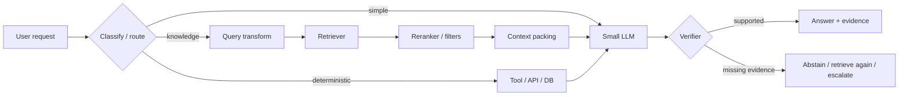

# Small LLM Architecture Playbook

Практический слой проекта для локальных и edge-моделей, где файл весов и/или рабочий бюджет обычно ограничен примерно 12 GB.

## 1. Размер весов не равен реальной памяти

Кроме весов учитываются KV-cache, временные буферы backend, embeddings/reranker/vision encoder на той же GPU, CUDA/runtime overhead, CPU/RAM offload, параллельные запросы и draft model при speculative decoding.

Поэтому критерий «веса помещаются в 12 GB» не гарантирует, что конфигурация стабильно работает в 12 GB VRAM.

## 2. Базовая архитектура надежного SLM



Идея: не заставлять одну малую модель одновременно быть памятью, поисковиком, калькулятором, планировщиком и проверяющим.

## 3. RAG как управляемая подсистема

RAG нужен там, где знания должны быть актуальными, частными, проверяемыми или слишком объемными для параметрической памяти. Он не должен включаться автоматически на каждый запрос.

Минимальный production-контур:

1. классификация необходимости retrieval;
2. query rewrite/decomposition при сложном запросе;
3. sparse, dense или hybrid retrieval;
4. metadata filtering;
5. reranking;
6. дедупликация;
7. context packing под фактический token budget;
8. генерация с evidence policy;
9. claim-level проверка ответа;
10. abstention при недостатке evidence.

Retrieval и generation должны оцениваться раздельно. Если правильный фрагмент не попал в top-k, система не должна компенсировать это уверенной догадкой.

## 4. Контроль галлюцинаций

Один self-check той же модели недостаточен как независимое доказательство. В зависимости от риска полезны:

- claim extraction;
- citation/evidence coverage;
- повторный retrieval по отдельным утверждениям;
- NLI/entailment-проверка;
- отдельный verifier;
- cross-model verification;
- детерминированные проверки чисел, идентификаторов, JSON/SQL;
- whitelist trusted sources;
- abstention;
- escalation на более сильную модель, tool или человека.

Полезные метрики: unsupported claim rate, grounded claim rate, citation precision/completeness, answerable-vs-unanswerable accuracy, abstention precision/recall, retrieval Recall@k/hit rate/MRR/nDCG.

## 5. Negative rejection / abstention

У системы должны быть минимум три исхода:

- `answer` — evidence достаточно;
- `retrieve_or_tool` — нужна дополнительная информация или вычисление;
- `abstain_or_escalate` — надежный ответ недостижим текущим бюджетом.

Confidence, сгенерированный самой LLM, не считается калиброванной вероятностью. Его надо проверять на отдельном наборе.

## 6. Context engineering

Для SLM качество часто определяется не максимальной длиной контекста, а его чистотой. Контролируются chunk size/overlap, top-k, дубликаты, порядок источников, stale content, противоречивые фрагменты, prompt injection из документов и token budget для вопроса/evidence/ответа.

Иногда уменьшение top-k и хороший rerank дают больший эффект, чем увеличение context window.

## 7. Квантование, KV-cache и скорость

Для ограниченной памяти рассматриваются 8/6/5/4-bit weights, quantized KV-cache при поддержке backend, context cap, paged cache, CPU/RAM offload, prompt/prefix cache, continuous batching и speculative/self-speculative decoding.

Любая оптимизация принимается только после A/B benchmark на целевых задачах. Рост tokens/s не должен скрывать падение factuality или рост отказов.

## 8. Тепловой и power-контур

Длительная LLM-нагрузка может приводить к thermal/power throttling, особенно на compact/edge системах. Проект добавляет аналитический блок 14 и опциональный runtime guard.

Пример конфигурации guard:

```json
{
  "runtime_guard_enabled": true,
  "runtime_guard_max_gpu_temp_c": 80,
  "runtime_guard_max_vram_pct": 95
}
```

Эти числа только пример синтаксиса, не универсальная рекомендация. Реальные пределы должны задаваться по документации конкретного GPU. По умолчанию guard выключен, а лимиты равны `null`.

Guard использует локальный `nvidia-smi` перед следующим LLM-этапом и блокирует продолжение при превышении заданного порога. Если LM Studio работает на другом компьютере, guard должен работать на inference-host или быть заменен удаленной телеметрией.

## 9. Soak test

Для длительного прогона логируются temperature, clocks/throttling, power, VRAM/RAM, queue depth, TTFT, tokens/s, error rate, OOM/restarts, retrieval latency и verifier latency. Цель — поймать деградацию через десятки минут, а не только показать короткий benchmark.

## 10. Research watchlist 2025–2026

Направления, которые стоит проверять экспериментально:

- hierarchical/quantized KV-cache;
- self-speculative/speculative decoding;
- power-aware/DVFS-aware inference на edge;
- adaptive retrieval — retrieval только при необходимости;
- trustworthy RAG с отдельной оценкой reliability/security/privacy;
- multi-layer hallucination verification;
- RAFT/retrieval-aware fine-tuning;
- graph-based retrieval для связных корпоративных знаний.

Проект не объявляет их автоматически лучшими: каждое направление должно сравниваться с простым baseline на целевом железе и целевом corpus.
